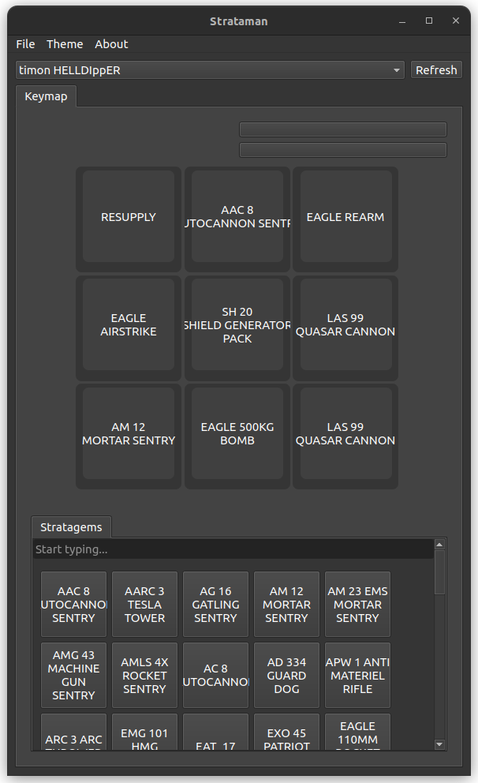
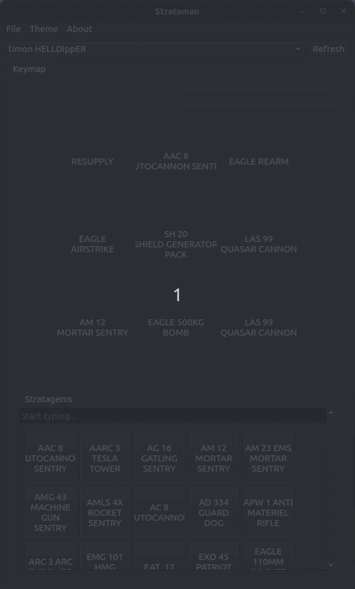

### strataman

Stratagem management system


# Docs and getting started
This project is a fork of [vial-gui](https://github.com/vial-kb/vial-gui). Meanwhile Vial-gui is a general purpose tool, this project specializes on remapping macros to one specific keyboard for one specific game.

To get started, go to Releases and download the latest installer: e.g.'*-win-installer'.



---


#### Releases

Development focuses on Windows targets.

#### Development

Python 3.6 is recommended (3.6 is the latest version that is officially supported by `fbs`).

Install dependencies:

```
python3 -m venv venv
source venv/bin/activate
pip install -r requirements.txt
```

To launch the application afterwards:

```
source venv/bin/activate
fbs run
```
